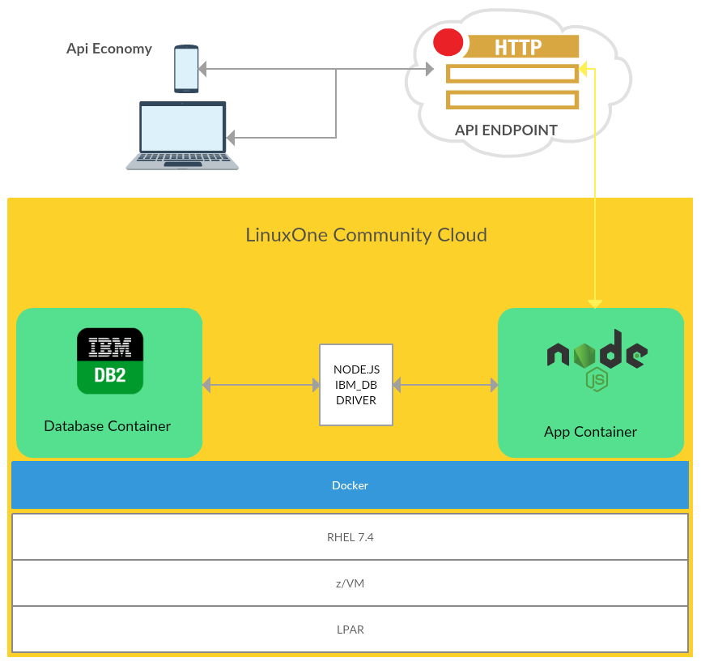

# Part 1 - Prerequisites
* Register at LinuxOne Community Cloud  [here](https://developer.ibm.com/linuxone/) for a trial account and get a RHEL VM.

* Click on Try Virtual Machines on the LinuxONE™ Community Cloud


* [Install git](https://git-scm.com/downloads) 

* Install docker:
```bash
sudo su
cd ~
yum -y install wget
wget ftp://ftp.unicamp.br/pub/linuxpatch/s390x/redhat/rhel7.3/docker-17.05.0-ce-rhel7.3-20170523.tar.gz
tar -xzvf docker-17.05.0-ce-rhel7.3-20170523.tar.gz
cp docker-17.05.0-ce-rhel7.3-20170523/docker* /usr/bin/
docker daemon -g /local/docker/lib &
```
<br>
<p align="center">
  
</p>
<br>

# Part 2 – IBM db2 Database Container
```bash
git clone https://github.com/codesenju/imdb_lite.git
cd imdb_lite 
```
* Download data.tar.gz file [here](https://mega.nz/#!BF0BRYAY!9vIGSwVtLU_FYtJf87WaxnAcrcaBHgJzDiGSInP359k) which has the records for the movie database.
* Copy the data.tar.gz into your folder /imdb_lite.
<br>
<p align="center">
  
</p>
<br>

* Run the command `` ls -alh `` to view directory contents and if your directory looks similar to the image bellow you can move on to the next step to build your db2 image.


* ### Build your db2 image.
```bash
docker build -t codesenju/imdb_lite .
```
<br>
<p align="center">
  
</p>
<br>

 - After successful build, run the command ``docker images`` to see your image loaded into docker. On completion, you should see the following output on console:


* Create a container network that will be used by your two micro services.
```bash 
docker network create mynet
```
* ### Run your db2 image as a container.
```bash
docker run -itd --net mynet --name micro_db2 --privileged=true -p 50000:50000 -e LICENSE=accept -e DB2INST1_PASSWORD=db2admin -e DBNAME= -v /usr/src/app:/database codesenju/imdb_lite
```
<br>
<p align="center">
  
</p>
<br>

  - After successfully executing the last command you can check if you have a container instance of db2 is running by executing the following command:
   
``$ docker ps ``

 - You should see the following output on console:
   


* ### Now we going to login into the db2 container and configure the database schema.

```shell
docker exec -ti <CONTAINER-ID> bash -c "su - db2inst1"
cd /var/custom
./createschema.sh
```
<br>
<p align="center">
  
</p>
<br>

 - When you're done exit the container with ``$ exit ``.

# Part 3 – Node.js App Container 
```shell
cd ~
git clone https://github.com/codesenju/nodejs_api4db2.git
cd nodejs_api4db2
docker build -t codesenju/nodejs_api4db2 .
docker run --net mynet -p 49160:8081 -d codesenju/nodejs_api4db2
```
# Part 4 - Test your environment
```shell
curl localhost:49160
```
